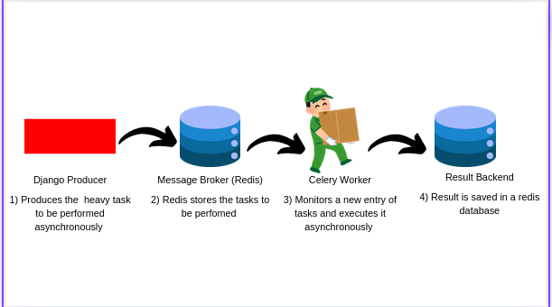

# :tractor: Tasks Scheduler
> :bulb: Coding Challenge
## 💬 Description
>  A simple integration of  django with redis and celery to simulate handling of heavy tasks with django
## :ledger: Challenge design
> Django works as the producer, redis works as both the message broker and result backend and finally celery as the worker 
  
## :camera: Screenshots and Flow
1. Heavy Task Overview
I simulated the heavy task with a simple sleep function that requires 20 seconds

	```python
		def compute():
			# A function that takes 20 seconds to simulate a heavy task
			sleep(20)
	```
	 	
1. Docker output logs
From the docker logs you can track how the task is loaded on server runtime and executed separately.
## 🔧 Code Setup
   1. Clone the repo
        ```bash
            git clone https://github.com/devoure/django-challenges.git

        ```
## 💻🏃‍♂️ Running Code Snippet
   1. Run code
        ```bash
            cd async-tasks/docker
            docker-compose up

        ```
